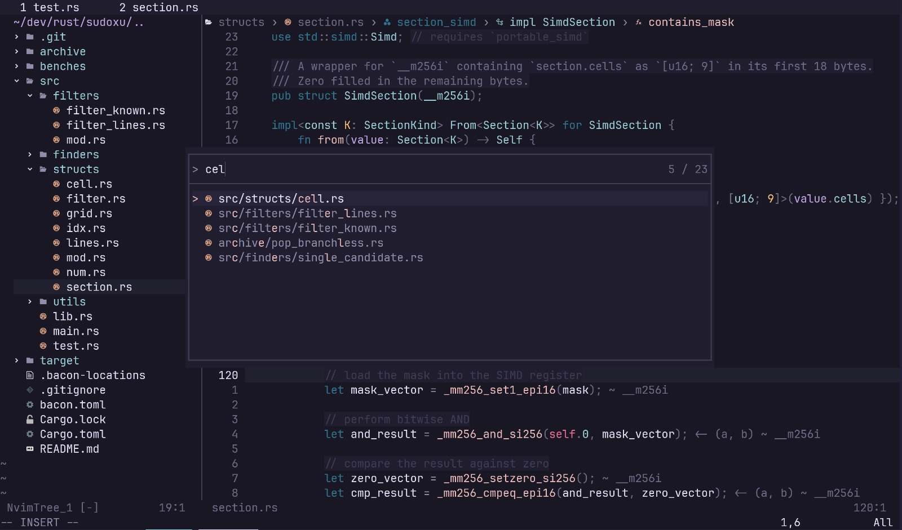

> [!NOTE]
> This repo has been replaced by my newer [dotfiles](https://github.com/aritmos/dotfiles) repo.

# ⚙️ ~/.config/nvim

My neovim configuration files

## 🔑 Key Points
- `neovim@0.9.4`
- 100% `.lua`
- Plugin Manager: [`folke/lazy.nvim`](https://www.github.com/folke/lazy.nvim) (auto bootstrap)
- Set up for **Rust**, **Python**, **Go**, and **Zig**
- Supports Linux, Windows, and MacOS
- Packed with all the standard IDE goodies one expects along with some opinionated addons and configurations:

## 🧩 Main Plugins
### 💻 Code
- [`nvim-treesitter/nvim-treesitter`](https://www.github.com/nvim-treesitter/nvim-treesitter)
- [`hrsh7th/nvim-cmp`](https://www.github.com/hrsh7th/nvim-cmp)
- [`kylechui/nvim-surround`](https://www.github.com/kylechui/nvim-surround)
- [`vim-scripts/ReplaceWithRegister`](https://www.github.com/vim-scripts/ReplaceWithRegister)
- [`windwp/nvim-autopairs`](https://www.github.com/windwp/nvim-autopairs)
- [`echasnovski/mini.comment`](https://www.github.com/echasnovski/mini.comment)
- [`mfussenegger/nvim-dap`](https://www.github.com/mfussenegger/nvim-dap)
- [`ray-x/go.nvim`](https://www.github.com/ray-x/go.nvim)
- [`simrat39/rust-tools.nvim`](https://www.github.com/simrat39/rust-tools.nvim)
- [`Canop/nvim-bacon`](https://www.github.com/Canop/nvim-bacon)

### 📃 Editing
- [`nvim-tree/nvim-tree.lua`](https://www.github.com/nvim-tree/nvim-tree.lua)
- [`stevearc/oil.nvim`](https://www.github.com/stevearc/oil.nvim)
- [`nvim-telescope/telescope.nvim`](https://www.github.com/nvim-telescope/telescope.nvim)
- [`ggandor/leap.nvim`](https://www.github.com/ggandor/leap.nvim)
- [`ggandor/flit.nvim`](https://www.github.com/ggandor/flit.nvim)
- [`thePrimeagen/harpoon`](https://www.github.com/thePrimeagen/harpoon)

### LSP
- [`williamboman/mason.nvim`](https://www.github.com/williamboman/mason.nvim)
- [`neovim/nvim-lspconfig`](https://www.github.com/neovim/nvim-lspconfig)
- [`nvimdev/lspsaga.nvim`](https://www.github.com/nvimdev/lspsaga.nvim)

### UI
- [`rose-pine/nvim`](https://www.github.com/rose-pine/nvim)
- [`nvim-lualine/lualine.nvim`](https://www.github.com/nvim-lualine/lualine.nvim)
